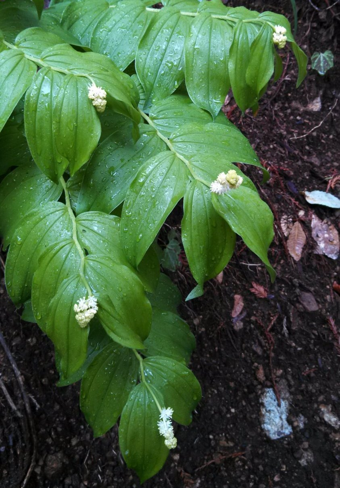

About
=====

*Smilacina* is a defunct genus of flowering plants within Asparagaceae. It previously contained false Solomon's seal (`Maianthemum racemosum <https://en.wikipedia.org/wiki/Maianthemum_racemosum>`_), which I always enjoy seeing when out and about in the woods.

