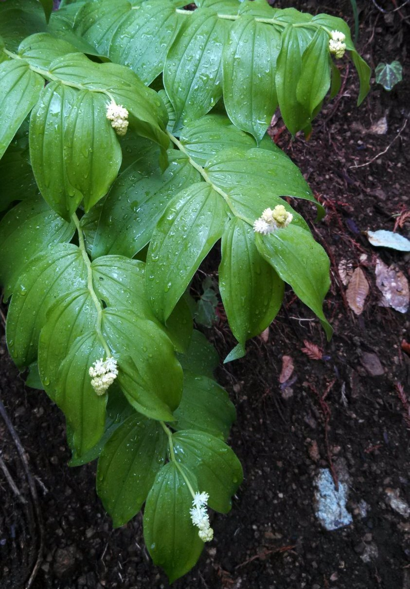

# About

*Smilacina* is a defunct genus of flowering plants within Asparagaceae. It previously contained, among others, false Solomon's seal ([*Maianthemum racemosum*](https://en.wikipedia.org/wiki/Maianthemum_racemosum)).

