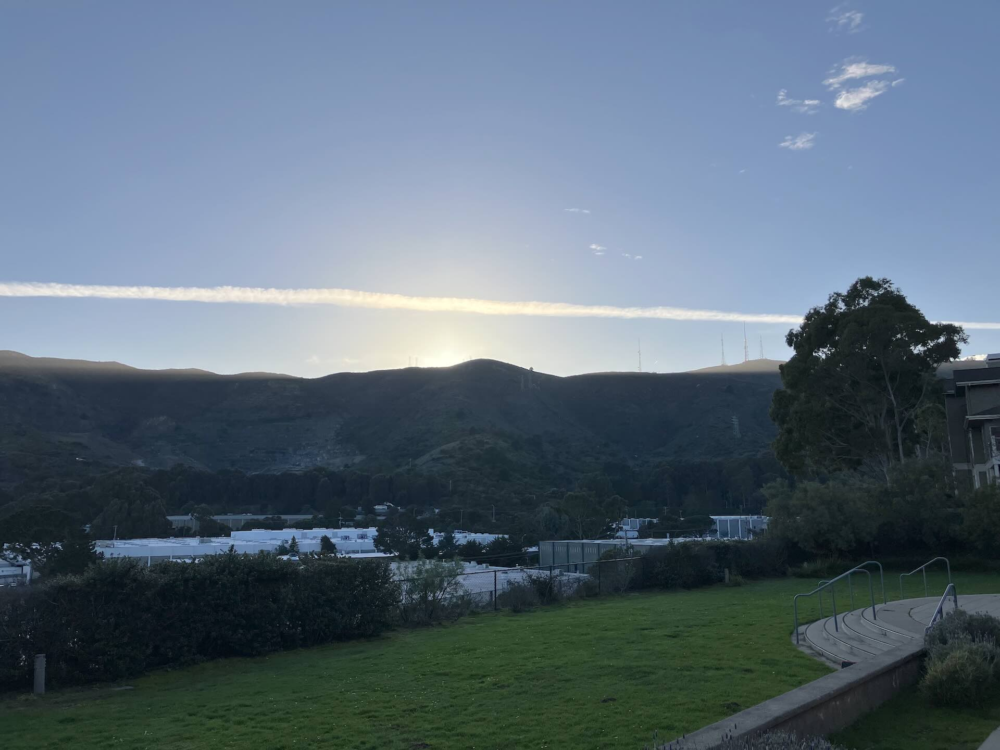
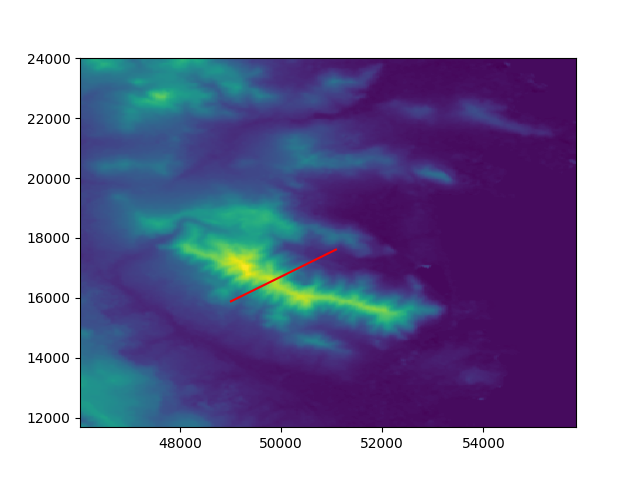
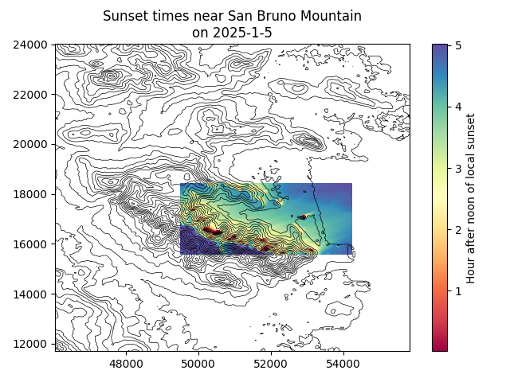

Brisbane Sunset
===============
I live just east of a big hill, and it gets dark a lot earlier than sunset. I wrote a `Python package <https://github.com/jwmccay/brisbane-sunset>`_ that tells me when the local sunset will be.

It works pretty well! Here's a picture from a local community center taken at 3:59 PM.

The sunset began at 3:56 PM and ended at 3:58 PM. If I run::

    sunset-run -d "2025-1-05" -oc "37.6924344,-122.4150331" \
        -r "data/n37_w123_subset_reproject.tif" \
        -cm "xy" \
        -vl 2700 -ni 100 -cm "xy" \
        -dp -fd "data/figs"

I get a prediction of 3:55 PM. Only off by a couple minutes, which is pretty good given the grid resolution and uncertainty in when the sunset is actually done. The predicted vector at the time of occlusion lines up well with where the sun is in the picture above.

I also have a script that finds the sunset time everywhere on a subset of the grid. Areas with direct western exposure have a sunset just after 5 PM on that day, which is the official sunset time. Areas in canyons barely see the sun after noon.

And here's results for 2026:

.. csv-table:: 2026 Sunset Times
   :widths: 20, 20, 20, 20

   ,Home,Mission Blue,Library
   2025-1-1,3:51,3:51,3:19
   2025-1-2,3:52,3:52,3:20
   2025-1-3,3:53,3:53,3:21
   2025-1-4,3:54,3:54,3:22
   2025-1-5,3:55,3:55,3:23
   2025-1-6,3:56,3:56,3:24
   2025-1-7,3:57,3:57,3:26
   2025-1-8,3:58,3:58,3:27
   2025-1-9,3:59,3:59,3:28
   2025-1-10,4:00,4:00,3:29
   2025-1-11,4:02,4:01,3:30
   2025-1-12,4:03,4:02,3:31
   2025-1-13,4:05,4:03,3:33
   2025-1-14,4:06,4:04,3:34
   2025-1-15,4:07,4:05,3:35
   2025-1-16,4:08,4:06,3:36
   2025-1-17,4:10,4:07,3:37
   2025-1-18,4:11,4:09,3:38
   2025-1-19,4:12,4:10,3:39
   2025-1-20,4:13,4:11,3:40
   2025-1-21,4:14,4:13,3:41
   2025-1-22,4:15,4:14,3:43
   2025-1-23,4:16,4:16,3:44
   2025-1-24,4:17,4:18,3:46
   2025-1-25,4:18,4:19,3:47
   2025-1-26,4:19,4:22,3:49
   2025-1-27,4:20,4:24,3:50
   2025-1-28,4:21,4:26,3:52
   2025-1-29,4:22,4:28,3:54
   2025-1-30,4:23,4:30,3:56
   2025-1-31,4:24,4:32,3:58
   2025-2-1,4:25,4:34,4:00
   2025-2-2,4:26,4:35,4:02
   2025-2-3,4:27,4:36,4:04
   2025-2-4,4:28,4:37,4:07
   2025-2-5,4:29,4:38,4:10
   2025-2-6,4:30,4:39,4:13
   2025-2-7,4:31,4:40,4:15
   2025-2-8,4:33,4:42,4:18
   2025-2-9,4:35,4:43,4:21
   2025-2-10,4:36,4:45,4:23
   2025-2-11,4:38,4:46,4:26
   2025-2-12,4:40,4:48,4:28
   2025-2-13,4:41,4:49,4:29
   2025-2-14,4:43,4:50,4:31
   2025-2-15,4:45,4:51,4:32
   2025-2-16,4:47,4:53,4:33
   2025-2-17,4:48,4:54,4:35
   2025-2-18,4:50,4:55,4:36
   2025-2-19,4:51,4:56,4:38
   2025-2-20,4:52,4:57,4:40
   2025-2-21,4:54,4:58,4:42
   2025-2-22,4:54,4:59,4:44
   2025-2-23,4:55,4:59,4:46
   2025-2-24,4:56,5:00,4:49
   2025-2-25,4:56,5:01,4:51
   2025-2-26,4:57,5:02,4:53
   2025-2-27,4:58,5:03,4:55
   2025-2-28,4:59,5:04,4:56
   2025-3-1,5:01,5:05,4:58
   2025-3-2,5:02,5:06,4:59
   2025-3-3,5:03,5:08,5:01
   2025-3-4,5:05,5:09,5:02
   2025-3-5,5:06,5:11,5:04
   2025-3-6,5:08,5:12,5:05
   2025-3-7,5:09,5:14,5:06
   2025-3-8,5:11,5:16,5:07
   2025-3-9,6:12,6:17,6:08
   2025-3-10,6:13,6:19,6:09
   2025-3-11,6:14,6:20,6:10
   2025-3-12,6:15,6:21,6:12
   2025-3-13,6:17,6:22,6:13
   2025-3-14,6:18,6:24,6:14
   2025-3-15,6:20,6:25,6:15
   2025-3-16,6:22,6:25,6:16
   2025-3-17,6:23,6:26,6:17
   2025-3-18,6:24,6:27,6:18
   2025-3-19,6:25,6:27,6:19
   2025-3-20,6:27,6:29,6:20
   2025-3-21,6:28,6:30,6:21
   2025-3-22,6:29,6:31,6:22
   2025-3-23,6:31,6:32,6:24
   2025-3-24,6:32,6:34,6:25
   2025-3-25,6:33,6:35,6:26
   2025-3-26,6:34,6:37,6:28
   2025-3-27,6:35,6:38,6:29
   2025-3-28,6:37,6:39,6:31
   2025-3-29,6:38,6:40,6:32
   2025-3-30,6:39,6:41,6:32
   2025-3-31,6:40,6:43,6:33
   2025-4-1,6:41,6:44,6:34
   2025-4-2,6:42,6:46,6:35
   2025-4-3,6:43,6:48,6:36
   2025-4-4,6:45,6:49,6:37
   2025-4-5,6:46,6:50,6:38
   2025-4-6,6:47,6:51,6:39
   2025-4-7,6:48,6:52,6:40
   2025-4-8,6:49,6:54,6:41
   2025-4-9,6:50,6:55,6:42
   2025-4-10,6:51,6:56,6:44
   2025-4-11,6:52,6:58,6:45
   2025-4-12,6:54,6:59,6:46
   2025-4-13,6:55,7:00,6:47
   2025-4-14,6:56,7:01,6:49
   2025-4-15,6:57,7:02,6:51
   2025-4-16,6:58,7:04,6:52
   2025-4-17,6:58,7:05,6:54
   2025-4-18,6:59,7:06,6:55
   2025-4-19,6:59,7:07,6:56
   2025-4-20,6:59,7:08,6:58
   2025-4-21,6:59,7:09,6:59
   2025-4-22,7:00,7:11,7:01
   2025-4-23,7:00,7:12,7:02
   2025-4-24,7:00,7:13,7:04
   2025-4-25,7:00,7:14,7:05
   2025-4-26,7:01,7:15,7:07
   2025-4-27,7:01,7:16,7:08
   2025-4-28,7:01,7:18,7:09
   2025-4-29,7:01,7:19,7:11
   2025-4-30,7:02,7:20,7:12
   2025-5-1,7:02,7:21,7:13
   2025-5-2,7:02,7:22,7:15
   2025-5-3,7:02,7:24,7:16
   2025-5-4,7:03,7:25,7:17
   2025-5-5,7:03,7:26,7:19
   2025-5-6,7:03,7:27,7:20
   2025-5-7,7:03,7:29,7:21
   2025-5-8,7:04,7:29,7:22
   2025-5-9,7:04,7:30,7:24
   2025-5-10,7:05,7:30,7:25
   2025-5-11,7:05,7:31,7:26
   2025-5-12,7:05,7:31,7:27
   2025-5-13,7:06,7:32,7:29
   2025-5-14,7:06,7:33,7:30
   2025-5-15,7:06,7:33,7:31
   2025-5-16,7:07,7:34,7:33
   2025-5-17,7:07,7:35,7:34
   2025-5-18,7:07,7:36,7:35
   2025-5-19,7:08,7:37,7:36
   2025-5-20,7:08,7:38,7:37
   2025-5-21,7:09,7:38,7:38
   2025-5-22,7:09,7:38,7:39
   2025-5-23,7:09,7:39,7:40
   2025-5-24,7:10,7:39,7:41
   2025-5-25,7:10,7:39,7:42
   2025-5-26,7:11,7:40,7:43
   2025-5-27,7:11,7:40,7:43
   2025-5-28,7:12,7:41,7:44
   2025-5-29,7:12,7:41,7:45
   2025-5-30,7:12,7:41,7:46
   2025-5-31,7:13,7:42,7:47
   2025-6-1,7:13,7:42,7:47
   2025-6-2,7:14,7:43,7:48
   2025-6-3,7:14,7:43,7:49
   2025-6-4,7:14,7:43,7:50
   2025-6-5,7:15,7:44,7:50
   2025-6-6,7:15,7:44,7:51
   2025-6-7,7:16,7:45,7:52
   2025-6-8,7:16,7:45,7:52
   2025-6-9,7:16,7:45,7:53
   2025-6-10,7:17,7:46,7:53
   2025-6-11,7:17,7:46,7:54
   2025-6-12,7:17,7:46,7:55
   2025-6-13,7:17,7:47,7:55
   2025-6-14,7:18,7:47,7:55
   2025-6-15,7:18,7:47,7:56
   2025-6-16,7:18,7:47,7:56
   2025-6-17,7:19,7:48,7:57
   2025-6-18,7:19,7:48,7:57
   2025-6-19,7:19,7:48,7:57
   2025-6-20,7:19,7:48,7:57
   2025-6-21,7:20,7:49,7:58
   2025-6-22,7:20,7:49,7:58
   2025-6-23,7:20,7:49,7:58
   2025-6-24,7:20,7:49,7:58
   2025-6-25,7:20,7:49,7:58
   2025-6-26,7:20,7:50,7:58
   2025-6-27,7:21,7:50,7:58
   2025-6-28,7:21,7:50,7:58
   2025-6-29,7:21,7:50,7:58
   2025-6-30,7:21,7:50,7:58
   2025-7-1,7:21,7:50,7:58
   2025-7-2,7:21,7:50,7:58
   2025-7-3,7:21,7:50,7:57
   2025-7-4,7:21,7:50,7:57
   2025-7-5,7:21,7:50,7:57
   2025-7-6,7:21,7:50,7:57
   2025-7-7,7:21,7:50,7:56
   2025-7-8,7:21,7:50,7:56
   2025-7-9,7:21,7:50,7:55
   2025-7-10,7:21,7:50,7:55
   2025-7-11,7:21,7:50,7:54
   2025-7-12,7:20,7:49,7:54
   2025-7-13,7:20,7:49,7:53
   2025-7-14,7:20,7:49,7:53
   2025-7-15,7:20,7:49,7:52
   2025-7-16,7:20,7:49,7:52
   2025-7-17,7:20,7:49,7:51
   2025-7-18,7:19,7:49,7:50
   2025-7-19,7:19,7:48,7:50
   2025-7-20,7:19,7:48,7:49
   2025-7-21,7:18,7:48,7:48
   2025-7-22,7:18,7:48,7:47
   2025-7-23,7:18,7:47,7:46
   2025-7-24,7:17,7:46,7:45
   2025-7-25,7:17,7:45,7:44
   2025-7-26,7:17,7:44,7:43
   2025-7-27,7:16,7:44,7:42
   2025-7-28,7:16,7:43,7:40
   2025-7-29,7:16,7:42,7:39
   2025-7-30,7:15,7:41,7:38
   2025-7-31,7:15,7:41,7:36
   2025-8-1,7:14,7:40,7:35
   2025-8-2,7:14,7:40,7:34
   2025-8-3,7:14,7:39,7:32
   2025-8-4,7:13,7:38,7:31
   2025-8-5,7:13,7:37,7:29
   2025-8-6,7:12,7:35,7:28
   2025-8-7,7:12,7:34,7:26
   2025-8-8,7:11,7:33,7:25
   2025-8-9,7:11,7:31,7:23
   2025-8-10,7:10,7:30,7:22
   2025-8-11,7:10,7:28,7:20
   2025-8-12,7:09,7:27,7:19
   2025-8-13,7:09,7:25,7:17
   2025-8-14,7:08,7:24,7:15
   2025-8-15,7:08,7:22,7:14
   2025-8-16,7:07,7:21,7:12
   2025-8-17,7:06,7:19,7:10
   2025-8-18,7:06,7:18,7:08
   2025-8-19,7:05,7:16,7:06
   2025-8-20,7:04,7:15,7:05
   2025-8-21,7:03,7:13,7:03
   2025-8-22,7:03,7:11,7:01
   2025-8-23,7:02,7:10,6:59
   2025-8-24,7:01,7:08,6:57
   2025-8-25,7:01,7:06,6:55
   2025-8-26,7:00,7:05,6:53
   2025-8-27,6:58,7:03,6:51
   2025-8-28,6:56,7:01,6:49
   2025-8-29,6:55,7:00,6:47
   2025-8-30,6:53,6:58,6:45
   2025-8-31,6:51,6:56,6:43
   2025-9-1,6:49,6:54,6:42
   2025-9-2,6:47,6:52,6:40
   2025-9-3,6:46,6:50,6:38
   2025-9-4,6:44,6:49,6:36
   2025-9-5,6:43,6:47,6:34
   2025-9-6,6:41,6:45,6:33
   2025-9-7,6:39,6:43,6:31
   2025-9-8,6:37,6:41,6:30
   2025-9-9,6:36,6:39,6:28
   2025-9-10,6:34,6:37,6:27
   2025-9-11,6:32,6:35,6:25
   2025-9-12,6:30,6:33,6:24
   2025-9-13,6:28,6:31,6:22
   2025-9-14,6:27,6:29,6:21
   2025-9-15,6:25,6:27,6:19
   2025-9-16,6:23,6:25,6:16
   2025-9-17,6:21,6:23,6:14
   2025-9-18,6:19,6:21,6:12
   2025-9-19,6:17,6:19,6:11
   2025-9-20,6:16,6:17,6:09
   2025-9-21,6:14,6:15,6:07
   2025-9-22,6:12,6:14,6:05
   2025-9-23,6:10,6:12,6:03
   2025-9-24,6:08,6:10,6:02
   2025-9-25,6:06,6:09,6:00
   2025-9-26,6:04,6:08,5:58
   2025-9-27,6:02,6:07,5:57
   2025-9-28,6:00,6:05,5:55
   2025-9-29,5:58,6:03,5:53
   2025-9-30,5:56,6:01,5:52
   2025-10-1,5:54,6:00,5:50
   2025-10-2,5:52,5:58,5:48
   2025-10-3,5:50,5:56,5:47
   2025-10-4,5:49,5:54,5:45
   2025-10-5,5:47,5:52,5:43
   2025-10-6,5:45,5:50,5:42
   2025-10-7,5:43,5:47,5:40
   2025-10-8,5:41,5:45,5:38
   2025-10-9,5:39,5:43,5:37
   2025-10-10,5:37,5:41,5:35
   2025-10-11,5:35,5:40,5:33
   2025-10-12,5:34,5:38,5:31
   2025-10-13,5:32,5:37,5:29
   2025-10-14,5:31,5:35,5:26
   2025-10-15,5:29,5:34,5:24
   2025-10-16,5:28,5:33,5:22
   2025-10-17,5:27,5:32,5:19
   2025-10-18,5:26,5:30,5:16
   2025-10-19,5:25,5:29,5:14
   2025-10-20,5:24,5:28,5:12
   2025-10-21,5:22,5:27,5:10
   2025-10-22,5:21,5:26,5:07
   2025-10-23,5:19,5:25,5:06
   2025-10-24,5:17,5:23,5:04
   2025-10-25,5:16,5:22,5:03
   2025-10-26,5:14,5:20,5:01
   2025-10-27,5:12,5:19,5:00
   2025-10-28,5:10,5:18,4:58
   2025-10-29,5:08,5:16,4:57
   2025-10-30,5:06,5:15,4:54
   2025-10-31,5:05,5:13,4:51
   2025-11-1,5:03,5:12,4:49
   2025-11-2,4:01,4:10,3:46
   2025-11-3,4:00,4:09,3:44
   2025-11-4,3:59,4:08,3:41
   2025-11-5,3:58,4:07,3:38
   2025-11-6,3:57,4:06,3:36
   2025-11-7,3:56,4:05,3:33
   2025-11-8,3:56,4:04,3:31
   2025-11-9,3:55,4:03,3:29
   2025-11-10,3:54,4:02,3:28
   2025-11-11,3:53,4:00,3:26
   2025-11-12,3:53,3:58,3:24
   2025-11-13,3:52,3:56,3:23
   2025-11-14,3:51,3:55,3:21
   2025-11-15,3:51,3:53,3:20
   2025-11-16,3:50,3:51,3:19
   2025-11-17,3:50,3:50,3:18
   2025-11-18,3:49,3:49,3:17
   2025-11-19,3:49,3:47,3:16
   2025-11-20,3:48,3:47,3:15
   2025-11-21,3:48,3:46,3:15
   2025-11-22,3:47,3:45,3:14
   2025-11-23,3:47,3:44,3:14
   2025-11-24,3:46,3:44,3:13
   2025-11-25,3:45,3:43,3:13
   2025-11-26,3:45,3:43,3:12
   2025-11-27,3:44,3:42,3:12
   2025-11-28,3:44,3:42,3:12
   2025-11-29,3:43,3:42,3:11
   2025-11-30,3:42,3:42,3:11
   2025-12-1,3:42,3:41,3:10
   2025-12-2,3:41,3:41,3:10
   2025-12-3,3:41,3:41,3:10
   2025-12-4,3:41,3:41,3:09
   2025-12-5,3:40,3:40,3:09
   2025-12-6,3:40,3:40,3:09
   2025-12-7,3:40,3:40,3:09
   2025-12-8,3:40,3:40,3:08
   2025-12-9,3:40,3:40,3:08
   2025-12-10,3:40,3:40,3:08
   2025-12-11,3:40,3:40,3:08
   2025-12-12,3:40,3:40,3:08
   2025-12-13,3:40,3:41,3:08
   2025-12-14,3:40,3:41,3:08
   2025-12-15,3:41,3:41,3:08
   2025-12-16,3:41,3:41,3:09
   2025-12-17,3:41,3:42,3:09
   2025-12-18,3:42,3:42,3:09
   2025-12-19,3:42,3:43,3:10
   2025-12-20,3:42,3:43,3:10
   2025-12-21,3:43,3:43,3:11
   2025-12-22,3:43,3:44,3:11
   2025-12-23,3:44,3:45,3:12
   2025-12-24,3:45,3:45,3:12
   2025-12-25,3:45,3:46,3:13
   2025-12-26,3:46,3:46,3:14
   2025-12-27,3:47,3:47,3:14
   2025-12-28,3:47,3:48,3:15
   2025-12-29,3:48,3:48,3:16
   2025-12-30,3:49,3:49,3:17
   2025-12-31,3:50,3:50,3:18